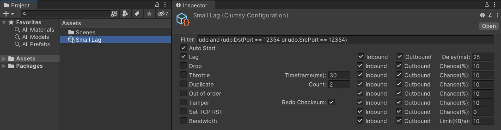
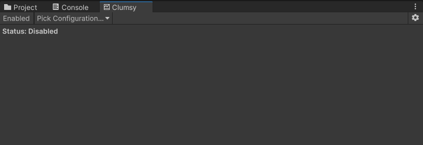
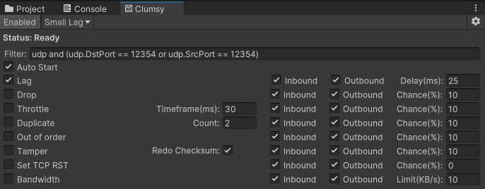
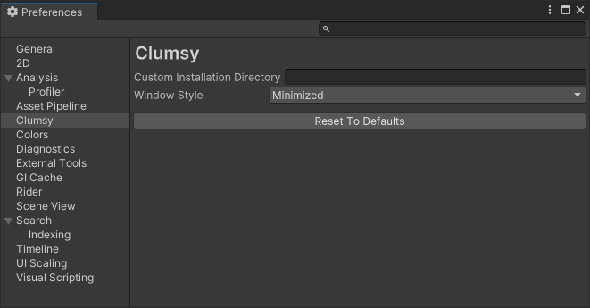

# About
This is a Unity integration for the incredibly useful [Clumsy](https://github.com/jagt/clumsy) network conditions simulation tool.

# Installation
Install the package [from its git URL](https://docs.unity3d.com/Manual/upm-ui-giturl.html) or [from a local copy](https://docs.unity3d.com/Manual/upm-ui-local.html).

# Quickstart
1. Create a `ClumsyConfiguration` asset using the `Assets > Create > Clumsy > Configuration` menu.

2. Open the Clumsy window using the `Window > Clumsy > Clumsy` menu:

3. Toggle the `Enabled` button and pick (using the dropdown) the `ClumsyConfiguration` that you created earlier:

4. Modify the configuration according to your needs.

5. Enter Play mode. An external `clumsy.exe` window should spawn (minimized).
6. If you wish to modify the configuration during Play mode, untoggle the `Enabled` button, make your modifications, and toggle it to relaunch Clumsy with the new config.
7. The external window/process will be destroyed when Play mode is exited.

# Preferences

* **Custom Installation Directory:** This package comes with a bundled version of Clumsy, but you can specify another version. Although at the moment this package only works with [a specific fork](https://github.com/Ohmnivore/clumsy).
* **Window Style:** The external Clumsy window can be launched minimized or completely hidden.

# API
Some projects might not be compatible with the auto-start workflow, ex if the connection ports aren't constant.

In that case the filter string can contain parameters in curly brackets, ex `udp and (udp.DstPort == {port} or udp.SrcPort == {port})`.

The user can provide those arguments at runtime using the `Runner.Instance.SetParameter` function call. Clumsy will automatically start once all the parameters in the filter string have been provided (this behavior is opt-out).

Additionally Clumsy can be controlled manually with the `Runner.Instance.SetConfiguration`, `Runner.Instance.Start`, and `Runner.Instance.Stop` function calls.

## Logging
The `CLUMSY_LOG` scripting define symbol can help trace the flow of all the above.

## Start workflows
In summary there's a few different ways to launch Clumsy:

1. Enable `Auto Start` in the configuration: Will launch automatically when entering Play mode.
2. Disable `Auto Start` in the configuration: Call `Runner.Instance.Start` manually.
3. The configuration's `Filter` contains parameters that need to be set at runtime:
   1. `Runner.Instance.SetParameter` with parameter `autoStart = true`: Will launch automatically once all parameters have been provided.
   2. `Runner.Instance.SetParameter` with parameter `autoStart = false`: Call `Runner.Instance.Start` manually after providing the parameters.

# Clumsy fork
A fork was necessary to apply a small patch. The patch ensures command line arguments are processed even when Clumsy launches in a minimized or hidden window.
